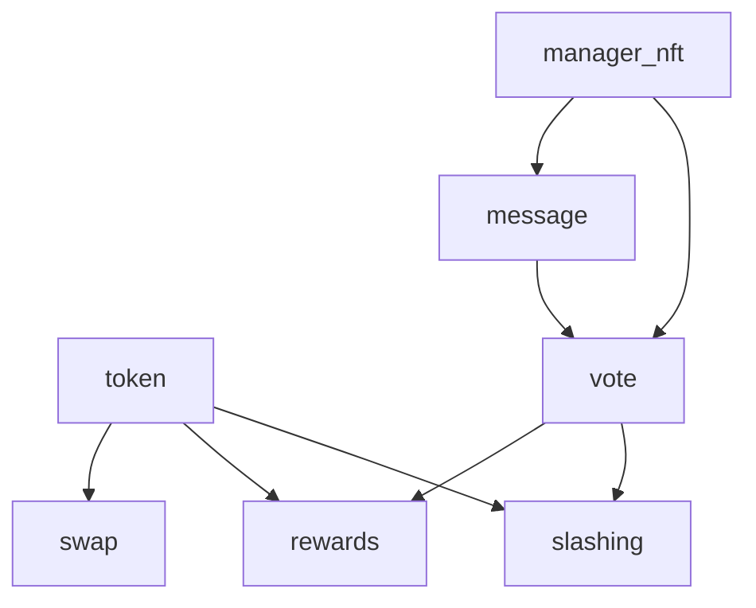

# SuiWorld Smart Contracts

## 📋 Overview

SuiWorld는 Sui 블록체인 기반의 탈중앙화 소셜 플랫폼입니다. 양질의 콘텐츠 생성을 장려하고 스팸을 방지하는 토크노믹스 시스템을 갖추고 있습니다.

## 🏗 Architecture

### Contract Modules

```
sources/
├── token.move          # SWT 토큰 및 트레저리 관리
├── manager_nft.move    # 매니저 NFT 시스템
├── message.move        # 메시지 CRUD 작업
├── vote.move           # 투표 및 거버넌스
├── swap.move           # DEX 기능
├── rewards.move        # 보상 분배
└── slashing.move       # 패널티 시스템
```

### Module Dependencies



## 📦 Modules

### 1. Token Module (`token.move`)

SWT (SuiWorld Token) 토큰의 생성과 관리를 담당합니다.

**주요 기능:**
- 토큰 발행 (100M SWT)
- 트레저리 관리 (30%)
- 스왑 풀 (70%)
- 보상 전송
- 토큰 소각

**초기화 파라미터:**
```move
TOTAL_SUPPLY = 100,000,000 SWT
TREASURY_PERCENTAGE = 30%
POOL_PERCENTAGE = 70%
DECIMALS = 6
```

### 2. Manager NFT Module (`manager_nft.move`)

플랫폼 거버넌스를 위한 매니저 NFT 시스템입니다.

**주요 기능:**
- 최대 12명의 매니저
- NFT 발행 및 전송 (거래 가능)
- 오판 추적
- BFT 검증
- 슬래싱 메커니즘

**매니저 권한:**
- 메시지 삭제
- 제안 투표
- 보상 수령

### 3. Message Module (`message.move`)

플랫폼의 핵심 콘텐츠 관리 시스템입니다.

**주요 기능:**
- 메시지 생성 (1000 SWT 필요)
- 좋아요/신고 기능
- 댓글 시스템
- 상태 관리
- **해시 기반 저장**: 제목과 내용은 해시값으로만 온체인 저장

**데이터 저장 방식:**
- 제목: `title_hash` (vector<u8>) - 오프체인 제목의 해시
- 내용: `content_hash` (vector<u8>) - 오프체인 내용의 해시
- 댓글: `content_hash` (vector<u8>) - 오프체인 댓글의 해시

**메시지 상태:**
- `NORMAL` (0): 일반 상태
- `UNDER_REVIEW` (1): 심사 중 (좋아요/신고 20개 이상)
- `HYPED` (2): 우수 콘텐츠
- `SPAM` (3): 스팸
- `DELETED` (4): 삭제됨

### 4. Vote Module (`vote.move`)

커뮤니티 거버넌스를 위한 투표 시스템입니다.

**주요 기능:**
- HYPE/SCAM 제안 생성
- 매니저 투표 (쿼럼: 4명)
- 보상/패널티 실행
- BFT 합의 검사

**보상 구조:**
```
HYPE 통과시:
- 작성자: +100 SWT
- 투표 매니저: +10 SWT

SCAM 통과시:
- 작성자: -200 SWT
- 투표 매니저: +10 SWT
```

### 5. Swap Module (`swap.move`)

SUI ↔ SWT 토큰 교환을 위한 AMM입니다.

**주요 기능:**
- Constant Product AMM (x*y=k)
- 0.3% 스왑 수수료
- 유동성 추가/제거
- 슬리피지 보호

**수수료 구조:**
```
SWAP_FEE = 0.3% (30 BPS)
MIN_LIQUIDITY = 1000
```

### 6. Rewards Module (`rewards.move`)

보상 분배 시스템입니다.

**주요 기능:**
- HYPE 보상 분배
- 매니저 투표 보상
- 주간 랜덤 에어드랍
- 보상 추적

**에어드랍:**
```
WEEKLY_AIRDROP = 1000 SWT
대상: Cooking 메시지 작성자
```

### 7. Slashing Module (`slashing.move`)

부정 행위에 대한 패널티 시스템입니다.

**주요 기능:**
- 스캠 메시지 패널티 (200 SWT)
- 경고 시스템
- 블랙리스트 관리
- 패널티 추적

**임계값:**
```
WARNING_THRESHOLD = 3회
BLACKLIST_THRESHOLD = 5회
```

## 🚀 Deployment

### Prerequisites

```bash
# Sui CLI 설치 확인
sui --version

# 지갑 설정
sui client active-address
```

### Local Network

```bash
# 1. 로컬 네트워크 시작
sui-test-validator

# 2. 컨트랙트 배포
./scripts/deploy_local.sh

# 3. 초기 데이터 설정
./scripts/initialize.sh
```

### Testnet

```bash
# 1. 테스트넷 배포
./scripts/deploy_testnet.sh

# 2. 초기화 실행
./scripts/initialize.sh
```

### Mainnet

```bash
# 1. 메인넷 배포 (주의: 실제 SUI 사용)
./scripts/deploy_mainnet.sh

# 2. 초기화 실행
./scripts/initialize.sh
```

### 초기화 프로세스 (`initialize.sh`)

배포 후 다음 작업들을 수행합니다:

1. **Manager NFT 발행**
   - 12명의 초기 매니저에게 NFT 민팅
   - 거버넌스 참여 권한 부여

2. **스왑 풀 초기 유동성**
   - SUI ↔ SWT 토큰 교환 풀 설정
   - 초기 유동성 공급

3. **테스트 메시지 생성**
   - 플랫폼 데모용 샘플 메시지
   - 기능 테스트용 초기 콘텐츠

4. **컨트랙트 정보 표시**
   - 배포된 패키지 ID
   - 사용 가능한 모듈 목록
   - 상호작용 명령어 가이드

**중요**: 실제 환경에서는 배포 시 생성된 객체 ID들을 사용해야 합니다.

자세한 배포 가이드는 [DEPLOYMENT.md](DEPLOYMENT.md)를 참조하세요.

## 🧪 Testing

### Run Tests

```bash
# 모든 테스트 실행
sui move test

# 특정 모듈 테스트
sui move test --filter token

# 커버리지 포함
sui move test --coverage
```

### Test Scenarios

1. **Token Tests**
   - 초기 발행 검증
   - 트레저리 분배
   - 전송 및 소각

2. **Manager NFT Tests**
   - NFT 발행 한도
   - 전송 메커니즘
   - 슬래싱 조건

3. **Message Tests**
   - 생성 요구사항
   - 상태 전환
   - 권한 검증

4. **Vote Tests**
   - 쿼럼 달성
   - 보상 계산
   - BFT 검증

5. **Swap Tests**
   - 가격 계산
   - 슬리피지
   - 유동성 관리

## 📊 Gas Optimization

### Estimated Gas Costs

| Operation | Gas (MIST) | Cost (SUI) |
|-----------|------------|------------|
| Deploy Package | 500,000,000 | 0.5 |
| Create Message | 10,000,000 | 0.01 |
| Like/Alert | 3,000,000 | 0.003 |
| Cast Vote | 5,000,000 | 0.005 |
| Swap Tokens | 8,000,000 | 0.008 |
| Transfer NFT | 6,000,000 | 0.006 |
| Execute Proposal | 15,000,000 | 0.015 |

### Optimization Tips

1. **Batch Operations**: 여러 작업을 하나의 트랜잭션으로 묶기
2. **Event Emission**: 필수 이벤트만 발생
3. **Storage**: 불필요한 데이터 저장 피하기
4. **Loops**: 루프 최소화 및 재귀 사용

## 🔒 Security

### Privacy & Data Protection

**해시 기반 콘텐츠 저장:**
- 모든 메시지 제목과 내용은 해시값으로만 온체인에 저장
- 원본 텍스트는 오프체인(IPFS, Arweave 등)에 저장
- 프라이버시 보호와 가스비 절감 효과
- 해시를 통한 데이터 무결성 검증

### Access Control

```move
// Manager Only
- delete_message
- slash_manager_nft

// Token Holder (1000+ SWT)
- create_message
- update_message
- create_comment

// Public
- like_message
- alert_message
- swap_tokens
```

### Security Considerations

1. **Reentrancy**: 상태 변경 전 검증
2. **Integer Overflow**: SafeMath 사용
3. **Access Control**: 역할 기반 권한
4. **Front-running**: 커밋-리빌 패턴 적용

## 📝 API Reference

### Core Functions

#### Token Module
```move
public entry fun transfer_from_treasury(
    treasury: &mut Treasury,
    amount: u64,
    recipient: address,
    ctx: &mut TxContext
)

public entry fun burn_tokens(
    treasury: &mut Treasury,
    coin: Coin<SWT>,
    ctx: &mut TxContext
)
```

#### Manager NFT Module
```move
public entry fun mint_manager_nft(
    registry: &mut ManagerRegistry,
    recipient: address,
    name: String,
    description: String,
    ctx: &mut TxContext
)
```

#### Message Module
```move
public entry fun create_message(
    board: &mut MessageBoard,
    swt_coin: &Coin<SWT>,
    title_hash: vector<u8>,      // 제목의 해시값
    content_hash: vector<u8>,     // 내용의 해시값
    tags: vector<String>,
    ctx: &mut TxContext
)

public entry fun create_comment(
    board: &mut MessageBoard,
    swt_coin: &Coin<SWT>,
    message_id: ID,
    content_hash: vector<u8>,     // 댓글 내용의 해시값
    ctx: &mut TxContext
)
```

#### Vote Module
```move
public entry fun cast_vote(
    proposal: &mut Proposal,
    manager_registry: &ManagerRegistry,
    vote_history: &mut ManagerVoteHistory,
    vote: bool,
    ctx: &mut TxContext
)
```

#### Swap Module
```move
public entry fun swap_sui_to_swt(
    pool: &mut SwapPool,
    sui_coin: Coin<SUI>,
    min_swt_out: u64,
    ctx: &mut TxContext
)
```

## 🛠 Development

### Project Structure

```
move/
├── sources/          # 스마트 컨트랙트 소스
├── tests/            # 테스트 파일
├── scripts/          # 배포 및 유틸리티 스크립트
├── Move.toml         # 패키지 구성
├── README.md         # 이 문서
└── DEPLOYMENT.md     # 배포 가이드
```

### Build

```bash
# 빌드
sui move build

# 빌드 정리
rm -rf build/
```

### Content Hashing Helper

메시지 생성 시 콘텐츠 해시를 생성하는 헬퍼 스크립트:

```bash
# 대화형 모드
./scripts/hash_content.sh

# 직접 입력 모드
./scripts/hash_content.sh "제목" "내용"

# 도움말
./scripts/hash_content.sh --help
```

**사용 예시:**
```bash
$ ./scripts/hash_content.sh "안녕하세요" "첫 번째 메시지입니다"

Generated Hashes:
Title Hash: 0xd0ca7e6b1e3e6394...
Content Hash: 0x8f9a2e3b5c7d9e1a...
```

### Environment Setup

```bash
# 로컬넷
sui client switch --env localnet

# 테스트넷
sui client switch --env testnet

# 메인넷
sui client switch --env mainnet
```
